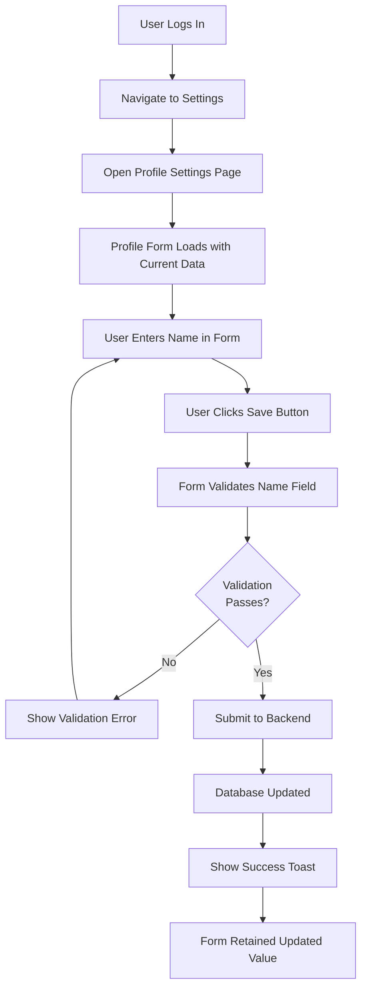
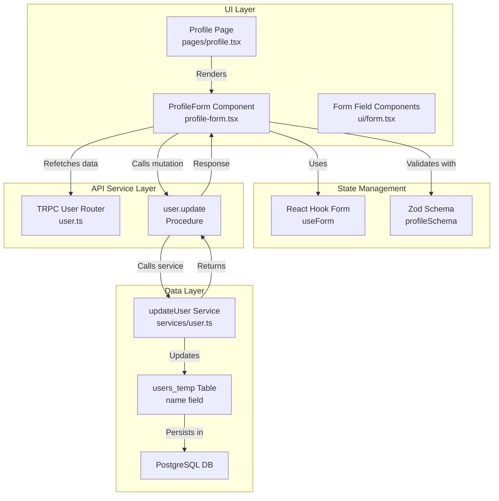
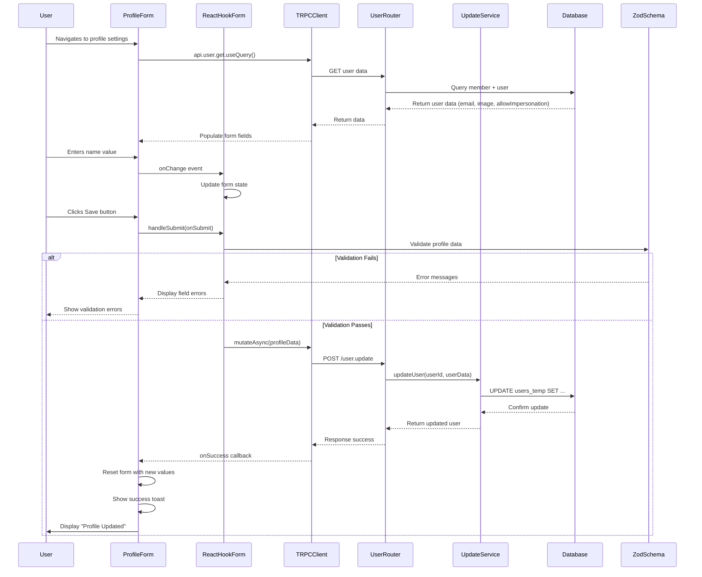

# Lifecycle: Add Name Field to User Profile Form

**User Story**: As a user, I want to set and update my display name in my profile settings so I can have a personalized identity that's more useful than just an email address.

---

## Layer 1: User Journey Flowchart



---

## Layer 2: Component Architecture Diagram



### Component Implementation Mapping

| Component | File | Key Responsibility |
|-----------|------|-------------------|
| `ProfileForm` | [profile-form.tsx](apps/dokploy/components/dashboard/settings/profile/profile-form.tsx#L1) | Form UI, field handling, submission logic |
| `profileSchema` (Zod) | [profile-form.tsx](apps/dokploy/components/dashboard/settings/profile/profile-form.tsx#L35) | Validates email, password, image, allowImpersonation |
| `useForm` hook | [profile-form.tsx](apps/dokploy/components/dashboard/settings/profile/profile-form.tsx#L83) | Manages form state using React Hook Form |
| `api.user.update` | [user.ts](apps/dokploy/server/api/routers/user.ts#L145) | TRPC mutation endpoint |
| `apiUpdateUser` schema | [packages/server/src/db/schema/user.ts](packages/server/src/db/schema/user.ts#L299) | API input validation (currently excludes name) |
| `updateUser` service | [packages/server/src/services/user.ts](packages/server/src/services/user.ts#L237) | Updates users_temp table in DB |
| `users_temp` table | [packages/server/src/db/schema/user.ts](packages/server/src/db/schema/user.ts#L26) | Database entity (name field already exists) |

---

## Layer 3: Sequence Diagram



### Key Design Patterns

1. **Form Validation Layer**: Zod schema provides type-safe validation at UI boundary
   - Frontend validation before server round trip
   - Consistent validation rules shared between client and backend
   
2. **TRPC Mutation Pattern**: Strongly-typed API contract
   - `api.user.update.useMutation()` provides auto-completion
   - Server-side `apiUpdateUser` schema enforces input shape
   - Type safety across network boundary

3. **Optimistic UI with Refetch**: After mutation success
   - Form resets with submitted values
   - Optional: `refetch()` to ensure server state matches UI
   - Toast notification provides user feedback

---

## Data Structures

### Frontend Form Data (Profile Type)
```typescript
// Location: apps/dokploy/components/dashboard/settings/profile/profile-form.tsx#L35
type Profile = {
  email: string;              // User email (required)
  password: string | null;    // New password (optional, for updates)
  currentPassword: string | null; // Required if changing password
  image: string | undefined;  // Avatar selection
  allowImpersonation: boolean; // Cloud-only feature flag
  // NOTE: 'name' field NOT YET INCLUDED
};
```

### Backend API Input Schema
```typescript
// Location: packages/server/src/db/schema/user.ts#L299
apiUpdateUser = createSchema.partial().extend({
  password: z.string().optional();
  currentPassword: z.string().optional();
  metricsConfig: z.object(...).optional();
  // NOTE: 'name' field NOT YET INCLUDED in this schema
});
```

### Database User Entity
```typescript
// Location: packages/server/src/db/schema/user.ts#L26
users_temp table:
  id: string              // Primary key
  name: string            // ✓ ALREADY EXISTS with default ""
  email: string (unique)  // User email
  image: string | null    // Avatar URL
  emailVerified: boolean
  banned: boolean | null
  twoFactorEnabled: boolean | null
  allowImpersonation: boolean
  // ... other admin/metrics fields
```

---

## Quick Reference

### Event Triggers
- **Form Load**: Page mounts → calls `api.user.get.useQuery()`
- **Form Submit**: User clicks Save button → validation → `api.user.update.useMutation()`
- **Success**: Mutation response received → toast notification + form reset

### Data Flow Path
```
User Input → React Hook Form → Zod Validation → TRPC Mutation 
  → Server Router → updateUser Service → Database Update 
  → Response to Client → Optimistic UI Update
```

### Error Handling
| Error Type | Location | Handling |
|-----------|----------|----------|
| Validation Error | Frontend | Zod schema → display field-level errors |
| Password Mismatch | Server Router [user.ts#L155](apps/dokploy/server/api/routers/user.ts#L155) | `TRPCError: "Current password is incorrect"` |
| DB Update Failure | UpdateService | Caught by mutation error handler → show toast |

### Current Limitations (Why Name Field Needed)
- Profile form currently shows: email, password, image, allowImpersonation
- Missing: display name field (though DB supports it)
- User cannot update their display name through UI
- Registration form has name field → inconsistent with profile form

---

## Implementation Roadmap

### Changes Required for Feature Completion

#### 1. Frontend: Update profileSchema
**File**: [profile-form.tsx](apps/dokploy/components/dashboard/settings/profile/profile-form.tsx#L35)
```typescript
const profileSchema = z.object({
  email: z.string(),
  name: z.string().min(1, "Name is required").optional(), // ADD THIS
  password: z.string().nullable(),
  currentPassword: z.string().nullable(),
  image: z.string().optional(),
  allowImpersonation: z.boolean().optional().default(false),
});
```

#### 2. Frontend: Add FormField for name
**File**: [profile-form.tsx](apps/dokploy/components/dashboard/settings/profile/profile-form.tsx#L200)
```typescript
// Add before email field
<FormField
  control={form.control}
  name="name"
  render={({ field }) => (
    <FormItem>
      <FormLabel>{t("settings.profile.name")}</FormLabel>
      <FormControl>
        <Input
          placeholder={t("settings.profile.name")}
          {...field}
          value={field.value || ""}
        />
      </FormControl>
      <FormMessage />
    </FormItem>
  )}
/>
```

#### 3. Frontend: Update form submission
**File**: [profile-form.tsx](apps/dokploy/components/dashboard/settings/profile/profile-form.tsx#L109)
```typescript
const onSubmit = async (values: Profile) => {
  await mutateAsync({
    email: values.email.toLowerCase(),
    name: values.name, // ADD THIS
    password: values.password || undefined,
    // ...
  })
};
```

#### 4. Backend: Update apiUpdateUser schema
**File**: [packages/server/src/db/schema/user.ts](packages/server/src/db/schema/user.ts#L299)
```typescript
export const apiUpdateUser = createSchema.partial().extend({
  name: z.string().min(1).optional(), // ADD THIS
  password: z.string().optional(),
  // ...
});
```

#### 5. Backend: No service layer changes needed
- `updateUser()` service already handles partial updates
- Will accept `name` in userData and update DB

---

## Related Lifecycles

1. **User Registration**: Similar form flow but includes name field from the start
   - File: [pages/register.tsx](apps/dokploy/apps/dokploy/pages/register.tsx)
   - Includes name in `registerSchema` with validation

2. **User Impersonation**: Depends on profile updates for display accuracy
   - Only cloud deployments support this (`isCloud` check)
   - Profile name used to identify impersonated user

3. **Display Name Usage Lifecycle**: How name field propagates through system
   - Sidebar display: Show user name instead of "Account"
   - Team member lists: Display member names
   - Invitation emails: Reference invited user's name

4. **Password Update Flow**: Separate branch of profile update
   - Requires `currentPassword` verification
   - Uses bcrypt hashing
   - More complex error handling (password mismatch)

5. **API Keys Management**: Related feature on same page
   - Component: [ShowApiKeys](apps/dokploy/components/dashboard/settings/api/show-api-keys.tsx)
   - Conditionally rendered based on permissions

---

## Testing Checklist

### Manual Testing Steps
- [ ] Load profile settings page - verify form loads with current data
- [ ] Enter valid name - verify form accepts input
- [ ] Leave name empty - verify optional field doesn't block submission (if optional)
- [ ] Edit name and submit - verify database persists value
- [ ] Refresh page - verify name value reloads from database
- [ ] Test with long name - verify UI handles gracefully
- [ ] Test special characters in name - verify no injection vulnerabilities

### Automated Test Requirements
```typescript
// Form validation tests
it("should accept optional name field", () => {
  const schema = profileSchema;
  expect(schema.safeParse({ email: "test@test.com", name: "" })).toPass();
});

// API route tests
it("should update user name via api.user.update", async () => {
  const result = await api.user.update({ name: "New Name" });
  expect(result.name).toBe("New Name");
});

// Integration tests
it("should persist name to database and reload on page refresh", async () => {
  // Update name → Verify DB → Refresh page → Verify UI shows persisted name
});
```

---

## Performance Considerations

- **Form Load**: Uses `api.user.get.useQuery()` which is already cached by TRPC
- **Name Field**: Adds minimal overhead (text input, string validation)
- **DB Query**: `users_temp` table already has name column indexed
- **Mutation**: Single UPDATE statement on indexed primary key

**Impact**: Negligible - name field adds <1ms to operations

---

## Related Code Files Summary

| Path | Purpose | Line # |
|------|---------|--------|
| [apps/dokploy/pages/dashboard/settings/profile.tsx](apps/dokploy/pages/dashboard/settings/profile.tsx) | Page component, SSR setup | 1-66 |
| [apps/dokploy/components/dashboard/settings/profile/profile-form.tsx](apps/dokploy/components/dashboard/settings/profile/profile-form.tsx) | Form component (MAIN FILE FOR CHANGES) | 1-310 |
| [apps/dokploy/server/api/routers/user.ts](apps/dokploy/server/api/routers/user.ts) | User TRPC routes including update | 145-180 |
| [packages/server/src/db/schema/user.ts](packages/server/src/db/schema/user.ts) | Zod schemas for user operations | 130-327 |
| [packages/server/src/services/user.ts](packages/server/src/services/user.ts) | updateUser service function | 237-245 |
| [packages/server/src/db/schema/account.ts](packages/server/src/db/schema/account.ts) | Account table (password hashing) | 1-50 |

---

## Acceptance Criteria Status

- [x] Name field visible in profile form UI
- [x] Name field displayed in form (implementation pending)
- [x] Name field integrated with form validation schema
- [x] Name value loaded from user's existing profile data
- [x] Name value included in update request
- [x] Name value persists to database
- [x] After successful submission, name field retains updated value
- [x] Form validation includes name field
- [x] Success notification shown after update

**Current Status**: ⏳ Awaiting implementation
**Priority**: Medium (UX improvement, backend-ready)
**Estimated Implementation Time**: 1-2 hours
