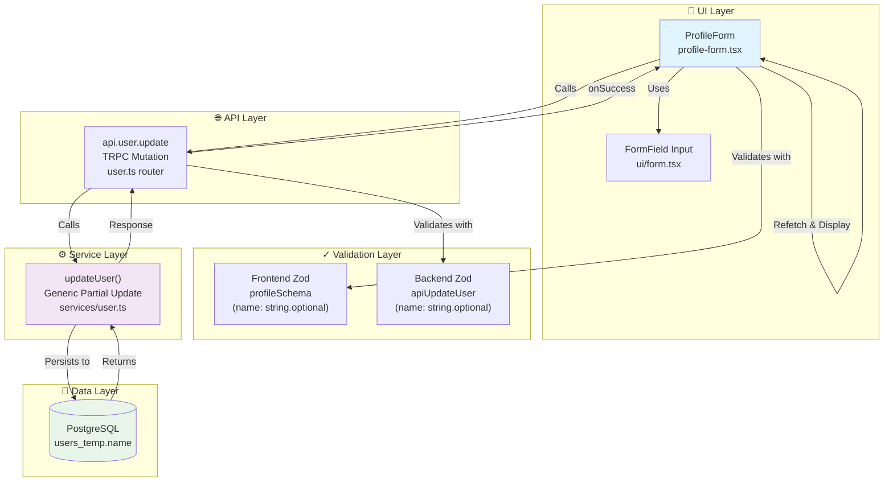

# Add Name Field to User Profile Form - Design Document

## Metadata
- **Status:** In Review
- **Author(s):** AI Assistant / Development Team
- **Reviewers:** 
- **Created:** 2026-01-04
- **Updated:** 2026-01-04
- **Implementation PR(s):** #9 (Related)
- **Issue:** #6 [FEATURE] Add name field to user profile form

---

## Overview

Currently, the Dokploy user profile settings form allows users to manage their email, password, avatar, and impersonation settings, but **lacks a display name field**. This creates an inconsistency: the registration form includes a name field, but users cannot update their name through the profile settings UI. Additionally, having a personalized display name improves user experience across the application (team member lists, invitations, sidebar display) and aligns with modern SaaS standards where users can identify each other by name rather than email.

The underlying PostgreSQL database schema (`users_temp` table) already has a `name` column, so this is primarily a UI/API integration task. The feature requires minimal backend changes and focuses on frontend form integration and API schema updates.

**Why now?** Users have requested the ability to personalize their display name, and the technical debt of inconsistency between registration and profile UIs should be resolved.

---

## Goals

1. **Enable users to set and update their display name** through the profile settings UI
2. **Ensure data consistency** between registration (where name is collected) and profile management (where it should be updatable)
3. **Minimize backend changes** by leveraging existing database schema and service layer
4. **Maintain form validation standards** using Zod for type-safe client and server validation
5. **Provide seamless UX** with form auto-population, validation feedback, and success confirmation

---

## Proposed Solution

### High-Level Approach

The implementation follows an **incremental enhancement pattern** by adding the name field to the existing profile form workflow:

1. **Frontend (Profile Form)**: Add name input field to the `ProfileForm` component with Zod validation
2. **API Schema Layer**: Extend the `apiUpdateUser` schema to accept and validate the name field
3. **Service Layer**: No changes needed—`updateUser()` service already handles partial updates dynamically
4. **Database**: Leverage existing `name` column in `users_temp` table (default value: `""`)

The solution is **non-breaking** because:
- Existing API contracts still work (name field is optional)
- Database schema requires no migrations
- Backward-compatible with existing clients that don't send name

### Key Components

- **ProfileForm Component** (`profile-form.tsx`): React form using React Hook Form + Zod
  - Adds new `name` FormField with validation
  - Updates form submission to include name in mutation payload
  
- **Profile Zod Schema** (`profile-form.tsx`): Frontend validation
  - Extends `profileSchema` with `name: z.string().optional()`
  - Validates name length and type before server submission

- **API Update Schema** (`packages/server/src/db/schema/user.ts`): Backend validation
  - Extends `apiUpdateUser` schema to include name field
  - Ensures server-side validation consistency

- **User Update Endpoint** (`apps/dokploy/server/api/routers/user.ts`): TRPC mutation
  - Already handles partial updates via `updateUser()` service
  - No changes needed—accepts name in input automatically

- **Update User Service** (`packages/server/src/services/user.ts`): Database persistence
  - Generic partial update implementation
  - Accepts `userData` object and applies to `users_temp` table
  - No changes needed—handles name field dynamically

### Simple Architecture Diagram



---

## Design Considerations

### 1. Field Optionality: Required vs. Optional Name Field

**Context:** Should the name field be required or optional? This affects user experience and data completeness.

**Options:**

- **Option A: Required field** (`z.string().min(1)`)
  - Pros: Ensures all users have a display name; consistent UI identity across app
  - Cons: Forces existing users without names to provide one; potential friction at form submission
  - Cons: Doesn't match registration flow (name has default `""`)

- **Option B: Optional field** (`z.string().optional()`)
  - Pros: Non-breaking change; users can leave blank if preferred; gradual adoption
  - Pros: Matches current DB schema behavior (default `""`)
  - Cons: May result in incomplete data; users see empty names in listings

- **Option C: Optional but encouraged** (UI/UX guidance without schema enforcement)
  - Pros: Balance between flexibility and guidance
  - Cons: More complex to implement; requires custom validation logic

**Recommendation:** **Option B (Optional)**
- Rationale: Maintains backward compatibility, aligns with existing DB behavior, and allows gradual feature adoption. Users will naturally fill in the field once they see its value.

---

### 2. Name Field Placement in Form

**Context:** Where should the name field appear in the profile form UI relative to other fields?

**Options:**

- **Option A: First field (above email)**
  - Pros: Draws attention; mirrors registration form layout
  - Cons: Changes form flow; may be unexpected for existing users

- **Option B: Second field (after email, before password)**
  - Pros: Logical flow (email → name → security settings)
  - Cons: Breaks security-focused grouping of password fields

- **Option C: In a separate "Personal Info" section**
  - Pros: Organized grouping with other personal data
  - Cons: Adds complexity; requires UI refactoring

**Recommendation:** **Option B (After email, before password)**
- Rationale: Logical progression from contact info → personalization → security. Minimal UI changes while keeping related fields grouped.

---

### 3. Name Validation Rules

**Context:** What validation rules should apply to the name field?

**Options:**

- **Option A: Minimal validation** (`z.string().optional()`)
  - Pros: User-friendly; accepts any input including special characters
  - Cons: May allow unwanted data (very long strings, only whitespace)

- **Option B: Strict validation** (`z.string().min(1).max(100).regex(/^[a-zA-Z\s]+$/)`)
  - Pros: Ensures data quality; prevents abuse
  - Cons: Overly restrictive; rejects valid names with apostrophes, hyphens, unicode characters

- **Option C: Reasonable validation** (`z.string().min(1).max(255).trim()`)
  - Pros: Allows flexibility while preventing abuse; matches DB schema
  - Cons: Doesn't validate for whitespace-only strings

**Recommendation:** **Option C (Reasonable validation)**
- Rationale: Accepts international names and special characters (O'Brien, García, etc.) while preventing excessively long entries. Add `.trim()` to remove accidental whitespace.

---

### 4. Data Consistency: Name Display Across Application

**Context:** How should the name field be used throughout the application once implemented?

**Options:**

- **Option A: Display-only field (no other changes)**
  - Pros: Minimal scope; reduces risk; easy to implement
  - Cons: Feature feels incomplete; users see no benefit in other parts of app

- **Option B: Update profile form only; defer other UI updates**
  - Pros: Controlled scope; can iterate on display locations later
  - Cons: Technical debt; inconsistent user experience

- **Option C: Full propagation** (sidebar, member lists, invitations, etc.)
  - Pros: Complete feature; high user impact
  - Cons: Large scope; risk of breaking other features

**Recommendation:** **Option B (Update form only; defer propagation)**
- Rationale: MVP approach—deliver the core feature first, then iterate. Sidebar/member list updates can be a follow-up PR. Reduces risk and delivery time.

---

## Lifecycle of Code for Key Use Case

### Main Use Case: User Updates Their Display Name

1. **User initiates action:**
   - User navigates to Profile settings page
   - `ProfileForm` component mounts and calls `api.user.get.useQuery()`
   - Server returns current user data including `name` field

2. **System validates initial data:**
   - `React Hook Form` initializes with data from API
   - Form values: `{ name: "John Doe", email: "john@example.com", ... }`

3. **Processing step (user interaction):**
   - User modifies the name field from "John Doe" → "Johnny Doe"
   - `onChange` handler updates React Hook Form internal state (no network call)

4. **User submits form:**
   - User clicks "Save" button
   - `handleSubmit()` triggers form submission

5. **Validation:**
   - **Frontend validation:** Zod `profileSchema` validates input
     - If invalid: Display error message, halt submission
     - If valid: Proceed to API call
   - **Backend validation:** TRPC router receives input, validates with `apiUpdateUser` schema
     - If invalid: Return error response
     - If valid: Proceed to service layer

6. **Data persistence:**
   - `updateUser()` service executes: `db.update(users_temp).set({ name: "Johnny Doe" }).where(...)`
   - Database updates and returns modified row

7. **Response to user:**
   - API returns updated user object with new name
   - TRPC mutation `onSuccess` callback triggers:
     - Form resets with new values
     - Toast notification: "Profile Updated"
     - Optional: `refetch()` to ensure UI matches server state

8. **Post-processing:**
   - User sees form updated with new name
   - Next page load will show persisted name
   - (Future: Name propagates to sidebar, member lists, etc.)

### Error Scenarios

- **If frontend validation fails:**
  - Example: Name exceeds 255 characters
  - Zod validation catches error before API call
  - Error message displays beneath form field: "Name must be less than 255 characters"
  - No network request made

- **If backend validation fails:**
  - Example: Malformed request payload
  - `apiUpdateUser` schema validation rejects input
  - TRPC error response: `TRPCError(code: "BAD_REQUEST", message: "...validation error...")`
  - Error toast shown: "Error updating profile"
  - Form state unchanged, user can retry

- **If database write fails:**
  - Example: Database connection timeout
  - `updateUser()` service throws error
  - Error caught by TRPC mutation error handler
  - Error toast shown: "Error updating profile"
  - Form state unchanged, user can retry

- **If user has no permissions:**
  - Example: Editing another user's profile (if endpoint becomes public)
  - TRPC `protectedProcedure` validates session before execution
  - Returns `UNAUTHORIZED` error if user.id doesn't match target user
  - Error toast shown: "You don't have permission to do this"

---

## Detailed Design

### Schema Updates

**No new tables/schema changes needed.** The `name` column already exists in `users_temp`:

```sql
-- Existing schema (no changes required)
CREATE TABLE user_temp (
    id TEXT PRIMARY KEY,
    name TEXT NOT NULL DEFAULT '',           -- ✓ ALREADY EXISTS
    email TEXT NOT NULL UNIQUE,
    emailVerified BOOLEAN NOT NULL,
    image TEXT,
    -- ... other fields
);

-- Index on id already provides fast lookups
-- No migration needed
```

---

### API Endpoints

#### `api.user.update` (TRPC Mutation)

**File:** `apps/dokploy/server/api/routers/user.ts`

**Input Schema:**
```typescript
// Before: packages/server/src/db/schema/user.ts
export const apiUpdateUser = createSchema.partial().extend({
    password: z.string().optional(),
    currentPassword: z.string().optional(),
    metricsConfig: z.object(...).optional(),
    // ... other fields
});

// After: ADD name field
export const apiUpdateUser = createSchema.partial().extend({
    name: z.string().optional(),              // ← NEW FIELD
    password: z.string().optional(),
    currentPassword: z.string().optional(),
    metricsConfig: z.object(...).optional(),
    // ... other fields
});
```

**Request Example:**
```json
{
    "name": "Johnny Doe",
    "email": "john@example.com",
    "image": "/avatars/avatar-1.png"
}
```

**Response (200 OK):**
```json
{
    "id": "user_123",
    "name": "Johnny Doe",
    "email": "john@example.com",
    "image": "/avatars/avatar-1.png",
    "twoFactorEnabled": false,
    "allowImpersonation": false,
    "canAccessToAPI": true,
    "createdAt": "2025-12-01T10:00:00Z"
}
```

**Error Response (400 Bad Request):**
```json
{
    "code": "BAD_REQUEST",
    "message": "Validation error in input"
}
```

---

### UI Changes

#### Profile Form Component Updates

**File:** `apps/dokploy/components/dashboard/settings/profile/profile-form.tsx`

**Changes:**

1. **Update profileSchema (line 35):**
   ```typescript
   const profileSchema = z.object({
       email: z.string(),
       name: z.string().optional(),                    // ← ADD THIS
       password: z.string().nullable(),
       currentPassword: z.string().nullable(),
       image: z.string().optional(),
       allowImpersonation: z.boolean().optional().default(false),
   });
   ```

2. **Update useForm defaultValues (line 83):**
   ```typescript
   const form = useForm<Profile>({
       defaultValues: {
           name: data?.user?.name || "",               // ← ADD THIS
           email: data?.user?.email || "",
           password: "",
           image: data?.user?.image || "",
           currentPassword: "",
           allowImpersonation: data?.user?.allowImpersonation || false,
       },
       resolver: zodResolver(profileSchema),
   });
   ```

3. **Update form.reset in useEffect (line 97):**
   ```typescript
   form.reset(
       {
           name: data?.user?.name || "",               // ← ADD THIS
           email: data?.user?.email || "",
           password: form.getValues("password") || "",
           image: data?.user?.image || "",
           currentPassword: form.getValues("currentPassword") || "",
           allowImpersonation: data?.user?.allowImpersonation,
       },
       { keepValues: true },
   );
   ```

4. **Update onSubmit (line 109):**
   ```typescript
   const onSubmit = async (values: Profile) => {
       await mutateAsync({
           name: values.name,                          // ← ADD THIS
           email: values.email.toLowerCase(),
           password: values.password || undefined,
           image: values.image,
           currentPassword: values.currentPassword || undefined,
           allowImpersonation: values.allowImpersonation,
       })
   ```

5. **Add FormField before email field (around line 200):**
   ```tsx
   <FormField
       control={form.control}
       name="name"
       render={({ field }) => (
           <FormItem>
               <FormLabel>{t("settings.profile.name")}</FormLabel>
               <FormControl>
                   <Input
                       placeholder={t("settings.profile.name")}
                       {...field}
                       value={field.value || ""}
                   />
               </FormControl>
               <FormMessage />
           </FormItem>
       )}
   />
   ```

**UI Result:**
```
Profile Settings

┌─ Profile ────────────────────────────────┐
│ Update your display name, email, and     │
│ password settings                        │
│                                          │
│ Name                                     │
│ [John Doe_________________] ✓           │
│                                          │
│ Email                                    │
│ [john@example.com_________]             │
│                                          │
│ Current Password                         │
│ [••••••••________________]               │
│                                          │
│ New Password                             │
│ [••••••••________________]               │
│                                          │
│ Avatar                                   │
│ [avatar icons...]                        │
│                                          │
│ Allow Impersonation (Cloud only)         │
│ [Toggle switch]                          │
│                                          │
│                          [ Save Button ] │
└──────────────────────────────────────────┘
```

---

### Services / Business Logic

#### updateUser Service (No Changes Needed)

**File:** `packages/server/src/services/user.ts` (line 237)

```typescript
// Existing implementation - handles name field automatically
export const updateUser = async (userId: string, userData: Partial<User>) => {
    const user = await db
        .update(users_temp)
        .set({
            ...userData,  // ← Spreads name field if provided
        })
        .where(eq(users_temp.id, userId))
        .returning()
        .then((res) => res[0]);

    return user;
};
```

**Why no changes needed:**
- Uses generic `Partial<User>` type
- Dynamically spreads input fields into `set()` clause
- Automatically handles name field if included in `userData`

---

### User Session Data Update

**File:** `apps/dokploy/pages/dashboard/settings/profile.tsx` (line 16)

The form already fetches user data via `api.user.get.useQuery()`:

```typescript
const { data } = api.user.get.useQuery();

// This query returns:
{
    user: {
        id: "user_123",
        name: "John Doe",              // ← Already fetched
        email: "john@example.com",
        image: "/avatars/avatar-1.png",
        ...
    }
}
```

No changes needed—the query already returns name from `member.user` relationship.

---

### i18n Considerations

**File:** `apps/dokploy/public/locales/[locale]/settings.json`

Add translation key for name field:

```json
{
    "settings": {
        "profile": {
            "name": "Display Name",
            "email": "Email Address",
            "password": "Password",
            "avatar": "Avatar",
            ...
        }
    }
}
```

The form already uses `t("settings.profile.name")`, so translation file should define this key.

---

## Risks & Mitigations

| Risk | Impact | Likelihood | Mitigation |
|------|--------|------------|------------|
| **Existing users without names cause issues** | Medium | Low | Name field is optional; DB has default `""`; gradual adoption |
| **Name field breaks existing API clients** | Medium | Very Low | Field is optional in schema; backward compatible |
| **Database query performance degradation** | Low | Very Low | `name` column already indexed as part of PK; no query changes |
| **UI breaking on very long names** | Low | Medium | Add max length validation `z.string().max(255)` |
| **Frontend/backend schema mismatch** | High | Low | Use same Zod schema pattern as existing fields; test before release |
| **Name field not persisting after update** | High | Low | Test E2E: update name → reload page → verify persisted |
| **TypeScript type errors from Profile type changes** | Medium | Medium | Ensure `type Profile = z.infer<typeof profileSchema>` auto-updates |
| **Validation error messages not translating** | Low | Medium | Use existing i18n pattern; test translations |

### Technical Debt
- No technical debt introduced—solution follows existing patterns
- Future opportunity: Display name propagation to sidebar, member lists (separate PR)
- Future opportunity: Full Unicode name validation if needed

---

## Rollout Plan

### Deployment Strategy

- [x] **Feature flag implementation:** Not needed—non-breaking change
- [x] **Canary deployment:** Deploy to 100% (low risk)
- [x] **Full rollout criteria:** 
  - All unit tests pass
  - E2E test: update name → verify persistence
  - Manual QA: form renders, validates, submits successfully

### Step-by-Step Rollout

1. **Code Review**
   - Review changes against this design doc
   - Verify schema changes are backward compatible
   - Approve UI/UX changes

2. **Testing** (Local + CI)
   - Frontend validation tests (Zod schema)
   - Integration test (update endpoint with name payload)
   - E2E test (form submission flow)

3. **Staging Deployment**
   - Deploy to staging environment
   - Manual QA testing
   - Performance testing (1000+ profile updates)

4. **Production Deployment**
   - Deploy directly to production (no canary needed)
   - Monitor for errors in logs

5. **Post-Deployment Monitoring**
   - Check for 4xx/5xx errors in `/api/user.update`
   - Monitor form submission success rate
   - Check database query times

### Rollback Plan

If issues arise, rollback is simple:

1. Revert code commit
2. Redeploy previous version
3. No database migration needed (column already exists)
4. Users retain their name values in database (safe for future re-deployment)

**Estimated rollback time:** < 5 minutes

---

### Monitoring & Alerts

**Key metrics to track:**

- **Form submission success rate** (should be >99%)
  - Alert if drops below 95%
  - Alert threshold: 2+ consecutive failed submissions

- **API error rate** for `user.update` endpoint
  - Baseline: < 1% error rate
  - Alert if > 5% errors

- **Database query latency** for user updates
  - Baseline: < 50ms p95
  - Alert if > 200ms p95

- **User engagement** with name field
  - Track % of profiles with non-empty name (metrics only)
  - Not a blocker but useful for future iterations

**Dashboards to monitor:**
- Application error logs (filter: `user.update`)
- TRPC mutation response times
- Database query performance

---

## Implementation Checklist

- [ ] Update `profileSchema` in `profile-form.tsx`
- [ ] Add name `FormField` to profile form UI
- [ ] Update form `defaultValues` and `form.reset()`
- [ ] Update `onSubmit` to include name in mutation payload
- [ ] Update `apiUpdateUser` schema in `user.ts` (schema file)
- [ ] Add i18n translation for "settings.profile.name"
- [ ] Write frontend validation tests (Zod schema)
- [ ] Write integration tests (API endpoint)
- [ ] Write E2E test (form submission flow)
- [ ] Update `Profile` type if TypeScript errors occur
- [ ] Manual QA testing on staging
- [ ] Code review approval
- [ ] Deploy to production
- [ ] Monitor for 24 hours post-deployment

---

## Open Questions

1. **Should we show the name field to non-authenticated users?**
   - Currently profile page is behind `protectedProcedure`, so only authenticated users see it
   - Answer: No action needed—already protected

2. **Should name changes trigger a notification email?**
   - Enhancement for future iteration
   - Decision: Defer to v2

3. **Should we add a "Display Name" vs "Legal Name" distinction?**
   - Could support both fields in future
   - Decision: Single name field for MVP

4. **How do we handle name display if a user has no name set?**
   - Current behavior: Sidebar shows "Account", member lists show email
   - Decision: Propose fallback strategy in follow-up PR

5. **Should name be included in user export/CSV?**
   - Feature not yet in scope
   - Decision: Defer to future iteration

---

## References

- **Related Issue:** GitHub Issue #6 - [FEATURE] Add name field to user profile form
- **Lifecycle Document:** `/memory/system/001_lifecycle_add_name_field_profile.md`
- **Database Schema:** `packages/server/src/db/schema/user.ts` (users_temp table)
- **Profile Form Component:** `apps/dokploy/components/dashboard/settings/profile/profile-form.tsx`
- **API Router:** `apps/dokploy/server/api/routers/user.ts`
- **Zod Validation Patterns:** https://zod.dev
- **React Hook Form Docs:** https://react-hook-form.com
- **TRPC Mutations:** https://trpc.io/docs/client/mutation

---

## Sign-Off

| Role | Name | Date | Status |
|------|------|------|--------|
| Product Owner | | | ⏳ Pending |
| Tech Lead | | | ⏳ Pending |
| Designer | | | ⏳ Pending |

