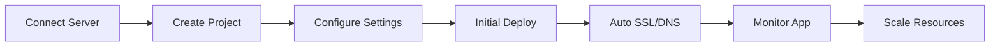
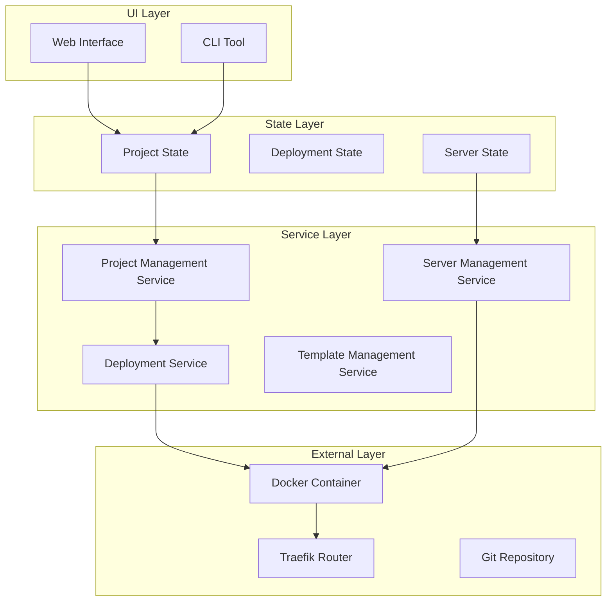
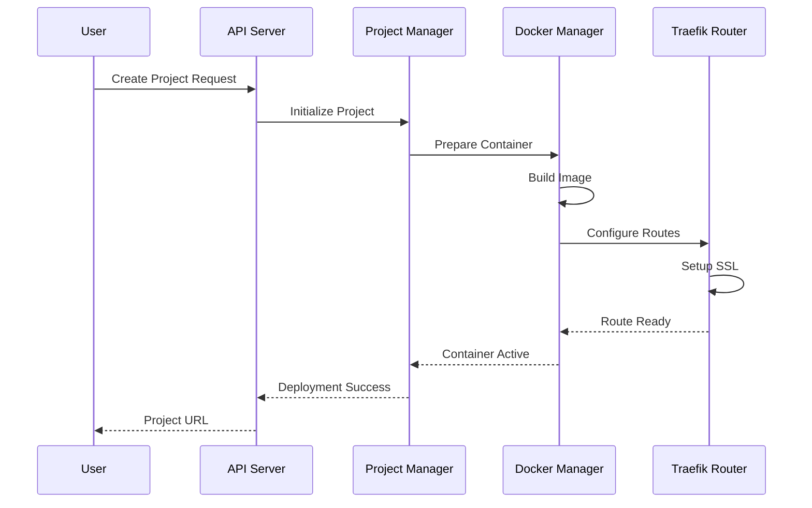

# Web Application Deployment Lifecycle

User Story: As a developer, I want to deploy my Next.js application to Dokploy so that it's accessible on the internet with HTTPS and automatic scaling.

## Layer 1: User Journey Flow



## Layer 2: Component Architecture



### Component Implementation Map

| Component | Implementation | Location |
|-----------|---------------|-----------|
| Project Management | ProjectService | packages/server/src/services/project/index.ts |
| Server Management | ServerService | packages/server/src/services/server/index.ts |
| Docker Management | RemoteDocker | packages/server/src/utils/servers/remote-docker.ts |
| Template Engine | TemplateService | packages/server/src/services/template/index.ts |
| State Management | Store | packages/server/src/lib/store.ts |

## Layer 3: Detailed Interaction Flow



### Key Design Patterns

1. **Factory Pattern**
   - Used in container creation
   - Abstracts deployment platform specifics
   
2. **Observer Pattern** 
   - Deployment state notifications
   - Real-time logs and metrics

3. **Strategy Pattern**
   - Platform-specific deployment strategies
   - Different scaling strategies

## Data Structures

```typescript
interface Project {
  id: string;
  name: string;
  repositoryUrl: string;
  branch: string;
  buildCommand?: string;
  startCommand?: string;
  envVars: Record<string, string>;
  domain?: string;
  createdAt: Date;
  updatedAt: Date;
}

interface Deployment {
  id: string;
  projectId: string;
  status: 'pending' | 'building' | 'deploying' | 'live' | 'failed';
  containerIds: string[];
  version: string;
  deployedAt: Date;
  logs: string[];
}

interface Server {
  id: string;
  name: string;
  ipAddress: string;
  sshKeyId?: string;
  provider: 'self-hosted' | 'aws' | 'digitalocean';
  resources: {
    cpu: number;
    memory: number;
    storage: number;
  };
}
```

## Quick Reference

Triggers:
- Git push to deployment branch
- Manual deployment via UI/CLI
- Scheduled auto-deployment
- Resource scaling triggers

Error Handling:
- Retry failed builds up to 3 times
- Rollback to last stable version on failure
- Notification via configured channels
- Error logs stored for 30 days

Resource Formats:
- Container memory: MB or GB units
- Storage: GB units
- Environment variables: KEY=value format
- Build logs: Timestamped JSON stream

## Related Lifecycles

1. Database Service Deployment
2. Multi-container Application Deployment
3. Static Site Deployment
4. SSL Certificate Renewal
5. Application Scaling Events

## Component Overview

- **API Server**: Handles all incoming requests and authentication
- **Project Manager**: Manages application lifecycle and configuration
- **Docker Manager**: Handles container operations and resource allocation
- **Template Manager**: Processes deployment templates and configurations
- **Server Manager**: Manages server connections and health monitoring
- **Traefik Router**: Handles routing, SSL, and load balancing
- **Monitoring Service**: Collects and processes metrics and logs