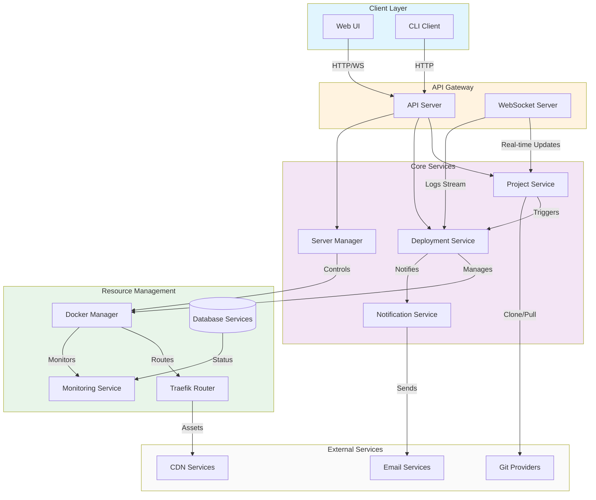

# System Architecture Overview

## 1. System Overview Diagram

## 2. Component Catalog

| Component | Technology/Framework | Primary Responsibility | Key Files | Heavy Logic |
|-----------|---------------------|----------------------|------------|-------------|
| API Server | Node.js/Express | Routes requests, handles authentication, and manages API lifecycle | `apps/api/src/index.ts`, `apps/api/src/schema.ts` | Request validation, auth middleware, rate limiting |
| Project Service | TypeScript/Custom | Manages application lifecycle from creation to deployment | `packages/server/src/services/project.ts`, `services/deployment.ts` | Git integration, build process management, environment configuration |
| Deployment Service | TypeScript/Custom | Handles deployment workflow and container orchestration | `packages/server/src/services/deployment.ts`, `services/rollbacks.ts` | Container orchestration, rollback handling, deployment strategies |
| Server Manager | TypeScript/Docker API | Manages server resources and container lifecycle | `packages/server/src/services/server.ts`, `utils/servers/remote-docker.ts` | SSH key management, resource allocation, health monitoring |
| Docker Manager | Dockerode | Handles container operations and networking | `packages/server/src/utils/servers/remote-docker.ts` | Container lifecycle, network configuration, volume management |
| Traefik Router | Traefik | Manages routing, SSL, and load balancing | `packages/server/src/services/certificate.ts` | SSL automation, route configuration, load balancing |
| Monitoring Service | Custom + Prometheus | Collects and processes metrics and logs | `packages/server/src/monitoring/*` | Metric collection, log aggregation, alert management |
| Database Services | Multiple | Manages database deployments and backups | `packages/server/src/services/{mysql,postgres,mongo}.ts` | Database provisioning, backup management, replication |

## 3. Technology Stack

### UI Layer
- Next.js + React
- TailwindCSS
- WebSocket Client

### State/Logic Layer
- TypeScript
- Node.js
- WebSocket Server

### Service/API Layer
- Express.js
- Docker API
- Traefik

### Data Layer
- PostgreSQL (main database)
- Redis (caching/queues)
- Docker volumes

### External Dependencies
- Git providers (GitHub, GitLab, Bitbucket)
- SMTP services
- CDN providers
- Cloud providers (optional)

## 4. Integration Points

### Internal Communication
- **API ↔ Services**: HTTP/REST with JSON
- **Services ↔ Docker**: Docker Engine API (HTTP)
- **Monitoring ↔ Components**: Prometheus metrics + custom events
- **WebSocket**: Real-time logs and status updates

### External Communication
- **Git Integration**: Provider-specific APIs (REST/GraphQL)
- **Email Notifications**: SMTP
- **CDN Integration**: Provider APIs (REST)
- **DNS Management**: Provider-specific APIs

### Data Flow Patterns
- Synchronous: Direct API calls for immediate operations
- Asynchronous: WebSocket for logs/updates
- Queue-based: Background jobs and scheduled tasks
- Event-driven: Deployment and monitoring events

## 5. Where to Start

### Understanding User Interactions
- Start with the web application deployment lifecycle: `/memory/system/001_lifecycle_web_app_deployment.md`
- Follow the Project Service implementation for core business logic

### Understanding Data Flow
- Begin with the API Server routing (`apps/api/src/index.ts`)
- Follow through to Project Service and Deployment Service

### Understanding Business Logic
- Project Service is the core orchestrator
- Deployment Service handles the complex deployment logic
- Server Manager for infrastructure management

### Key Entry Points
1. API routes for understanding available operations
2. Project Service for business logic implementation
3. Deployment Service for understanding the deployment process
4. Server Manager for infrastructure operations

The most complex logic lives in:
- Deployment orchestration
- Container management
- Database provisioning
- Real-time monitoring and logging